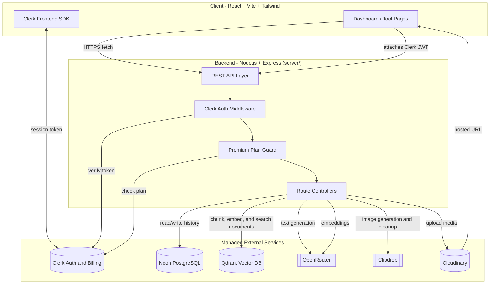

# AI SaaS App

AI SaaS App is a full-stack productivity platform for writing, image generation, image cleanup, resume review, code assistance, and RAG-based document chat. It uses Clerk for authentication and premium plan gating, Neon Postgres for history, OpenRouter for text generation and embeddings, Qdrant for vector search, Clipdrop for image operations, and Cloudinary for media storage.


---

## Table of Contents

- [Features](#features)
- [Tech Stack](#tech-stack)
- [System Architecture](#system-architecture)
- [Request Flow](#request-flow)
- [Getting Started](#getting-started)
- [Environment Variables](#environment-variables)
- [API Routes](#api-routes)
- [Frontend Routes](#frontend-routes)
- [Folder Structure](#folder-structure)
- [Troubleshooting](#troubleshooting)
- [License](#license)

---

## Features

### Free tools

| Tool | Description |
|---|---|
| AI Article Writer | Generates long-form articles from a prompt |
| Blog Title Generator | Suggests blog titles from a topic or keyword set |
| Image Generator | Creates images from text prompts |
| Remove Image Background | Removes the background from an uploaded image |
| Remove Image Object | Removes a selected object from an image |
| Resume Reviewer | Reviews an uploaded PDF resume and returns feedback |

### Premium tools

Premium tools require an authenticated user with an active Clerk premium plan.

| Tool | Description |
|---|---|
| AI Email Writer | Drafts professional emails from a short brief |
| AI Text Summarizer | Condenses long text into a summary |
| Cover Letter Generator | Generates a tailored cover letter |
| AI Code Reviewer | Reviews code and suggests improvements |
| AI Document Chat | Upload documents (PDF/DOCX/TXT) and chat with them using retrieval-augmented generation |

### App capabilities

- Clerk-based sign-in, session verification, and billing-aware plan checks
- Dashboard for browsing tools and recent creations
- Saved creation history per user
- Public gallery for published creations
- Like and unlike support for published creations
- Document upload, chunking, embedding, and semantic retrieval for AI Document Chat
- Per-user document quota and chat history for the RAG feature
- Responsive React and Tailwind UI

## Tech Stack

| Layer | Technology |
|---|---|
| Frontend | React, Vite, Tailwind CSS |
| Backend | Node.js, Express |
| Database | Neon PostgreSQL |
| Vector database | Qdrant |
| Auth | Clerk |
| AI text | OpenRouter |
| Embeddings | OpenRouter (default) or OpenAI, via LangChain |
| Document parsing | pdf-parse, mammoth |
| Image operations | Clipdrop |
| Media storage | Cloudinary |
| Deployment | Kubernetes in `k8s/` |

---

## System Architecture

The app follows a three-layer shape: the React client talks to an Express API, and the API brokers requests to managed services for auth, billing, text generation, image processing, and storage.



### Key notes

- The API is stateless. Clerk owns session state and the backend only verifies it.
- Free and premium AI routes both require a valid Clerk session.
- Premium routes add a second guard that checks for an active premium plan.
- Text generation stays server-side so API keys never reach the browser.
- Images are streamed through Cloudinary instead of being persisted on local disk.
- Every creation is stored in Neon so it can be surfaced in the user dashboard.
- RAG document metadata and chat history live in Neon; document vectors live in Qdrant.

## Request Flow

Example: a logged-in user generates a cover letter.

1. The client sends `POST /api/ai/generate-cover-letter` with a Clerk session token.
2. `auth` verifies the token and resolves the Clerk user.
3. `requirePremium` confirms the user has the premium plan.
4. The controller builds a prompt and calls OpenRouter.
5. The generated result is written to Neon as a creation record.
6. The API returns the response to the client, which renders it in the dashboard.

Image generation and cleanup follow the same pattern, except the controller also sends the file through Clipdrop and stores the final asset in Cloudinary.

### AI Document Chat (RAG)

Uploading a document:

1. The client sends `POST /api/rag/documents` with the file (multipart) and a Clerk session token.
2. `auth` and `requirePremium` gate the request, and the per-user document quota is checked.
3. The document is parsed (PDF/DOCX/TXT), split into chunks, embedded via OpenRouter (or OpenAI), and upserted into Qdrant.
4. Document metadata (status, chunk count, embedding model) is stored in Neon.

Asking a question:

1. The client sends `POST /api/rag/query` (or `/api/rag/chat`) with a question and an optional `documentId`.
2. The question is embedded and matched against Qdrant to retrieve the top relevant chunks, scoped to the user (and document, if given).
3. The retrieved chunks are passed to OpenRouter to generate a grounded answer with source citations.
4. The exchange is saved as a chat record in Neon and returned to the client.

---

## Getting Started

### 1. Clone the repository

```bash
git clone <your-repo-url>
cd ai-saas-app
```

If you are already inside the project folder, you can skip this step.

### 2. Install dependencies

```bash
cd server
npm install

cd ../client
npm install
```

### 3. Configure environment variables

See [Environment Variables](#environment-variables) below.

### 4. Run the app locally

Start the backend in one terminal:

```bash
cd server
npm start
```

Start the frontend in another terminal:

```bash
cd client
npm run dev
```

Open the Vite URL shown in the terminal, usually `http://localhost:5173`.

---

## Environment Variables

Create `server/.env`:

```env
PORT=5000
DATABASE_URL=your_neon_postgresql_connection_string
CLERK_SECRET_KEY=your_clerk_secret_key
OPENROUTER_API_KEY=your_openrouter_api_key
OPENROUTER_MODEL=your_openrouter_model_id
CLOUDINARY_CLOUD_NAME=your_cloudinary_cloud_name
CLOUDINARY_API_KEY=your_cloudinary_api_key
CLOUDINARY_API_SECRET=your_cloudinary_api_secret
CLIPDROP_API_KEY=your_clipdrop_api_key

# RAG / AI Document Chat
QDRANT_URL=your_qdrant_cloud_url
QDRANT_API_KEY=your_qdrant_api_key
EMBEDDING_PROVIDER=openrouter
EMBEDDING_MODEL=nvidia/nemotron-3-embed-1b:free
```

`server/.env.example` documents additional optional overrides (collection name, vector size, chunk size/overlap, retrieval top-k, file size and document count limits) — all have sensible built-in defaults.

Create `client/.env`:

```env
VITE_CLERK_PUBLISHABLE_KEY=your_clerk_publishable_key
VITE_BASE_URL=http://localhost:5000
```

### Notes

- The client also supports runtime config for the Clerk publishable key in `client/src/config.js`.
- `VITE_BASE_URL` should point to the backend while developing locally.
- `CLIPDROP_API_KEY` is required for image generation and cleanup routes.
- `CLOUDINARY_*` variables are required for uploaded and generated image storage.
- `QDRANT_URL` and `QDRANT_API_KEY` are required for AI Document Chat; use Qdrant Cloud and never expose these to the client.
- Embeddings route through OpenRouter by default (no separate account needed). Set `EMBEDDING_PROVIDER=openai` with `OPENAI_API_KEY` to call OpenAI directly instead.
- If you deploy elsewhere, set the same values as environment secrets or runtime config.

---

## API Routes

### Health check

| Method | Route |
|---|---|
| GET | `/` |

### AI routes

All AI routes require a valid Clerk session. Premium routes also require an active premium plan.

| Method | Route | Access |
|---|---|---|
| POST | `/api/ai/generate-article` | Auth required |
| POST | `/api/ai/generate-blog-title` | Auth required |
| POST | `/api/ai/generate-image` | Auth required |
| POST | `/api/ai/remove-image-background` | Auth required |
| POST | `/api/ai/remove-image-object` | Auth required |
| POST | `/api/ai/resume-review` | Auth required |
| POST | `/api/ai/write-email` | Premium required |
| POST | `/api/ai/summarize-text` | Premium required |
| POST | `/api/ai/generate-cover-letter` | Premium required |
| POST | `/api/ai/review-code` | Premium required |

### User routes

| Method | Route | Access |
|---|---|---|
| GET | `/api/user/get-user-creations` | Auth required |
| GET | `/api/user/get-published-creations` | Auth required |
| POST | `/api/user/toggle-like-creation` | Auth required |

### RAG routes (AI Document Chat)

All routes below `/health` require Clerk auth and an active premium plan.

| Method | Route | Access |
|---|---|---|
| GET | `/api/rag/health` | Public (used by k8s liveness probes) |
| POST | `/api/rag/documents` | Premium required (multipart file upload) |
| POST | `/api/rag/documents/upload` | Premium required (alias of above) |
| GET | `/api/rag/documents` | Premium required |
| GET | `/api/rag/documents/:id` | Premium required |
| DELETE | `/api/rag/documents/:id` | Premium required |
| POST | `/api/rag/query` | Premium required |
| POST | `/api/rag/chat` | Premium required (alias of `/query`) |
| GET | `/api/rag/chats` | Premium required |

---

## Frontend Routes

| Route | Page |
|---|---|
| `/` | Landing page or redirect into the app when signed in |
| `/ai` | Dashboard |
| `/ai/write-article` | AI Article Writer |
| `/ai/blog-titles` | Blog Title Generator |
| `/ai/review-resume` | Resume Reviewer |
| `/ai/email-writer` | AI Email Writer |
| `/ai/summarizer` | AI Text Summarizer |
| `/ai/cover-letter` | Cover Letter Generator |
| `/ai/code-reviewer` | AI Code Reviewer |
| `/ai/document-chat` | AI Document Chat |
| `/ai/upgrade` | Upgrade page |

---

## Folder Structure

```text
ai-saas-app/
|-- client/   # React + Vite + Tailwind frontend
|-- server/   # Node.js + Express backend API
|-- k8s/      # Kubernetes manifests
|-- README.md
```

---

## Troubleshooting

| Symptom | Check |
|---|---|
| Backend fails to start | `DATABASE_URL`, `CLERK_SECRET_KEY`, and `OPENROUTER_*` are set |
| Image routes return 503 | `CLIPDROP_API_KEY` is missing or invalid |
| Uploaded images fail | `CLOUDINARY_CLOUD_NAME`, `CLOUDINARY_API_KEY`, and `CLOUDINARY_API_SECRET` are set |
| Frontend cannot authenticate | `VITE_CLERK_PUBLISHABLE_KEY` is set correctly |
| Frontend requests fail | `VITE_BASE_URL` points to the running backend |
| Premium routes return 403 | The Clerk user does not have the premium plan |
| Resume upload fails | The file is a PDF and is under the size limit enforced by the server |
| `/api/rag/health` returns 503 | `QDRANT_URL` / `QDRANT_API_KEY` are missing or invalid, or Qdrant is unreachable |
| Document upload fails or stays "processing" | Check server logs for parsing/embedding errors; confirm `EMBEDDING_PROVIDER`/`EMBEDDING_MODEL` and matching API key are set |
| Document upload returns 429 | Per-user document quota (`MAX_DOCS_PER_USER`) reached — delete existing documents |
| Document chat answers are empty or off-topic | Re-check the embedding model's vector size matches the Qdrant collection; recreate the collection after changing models |

---

## License

MIT
