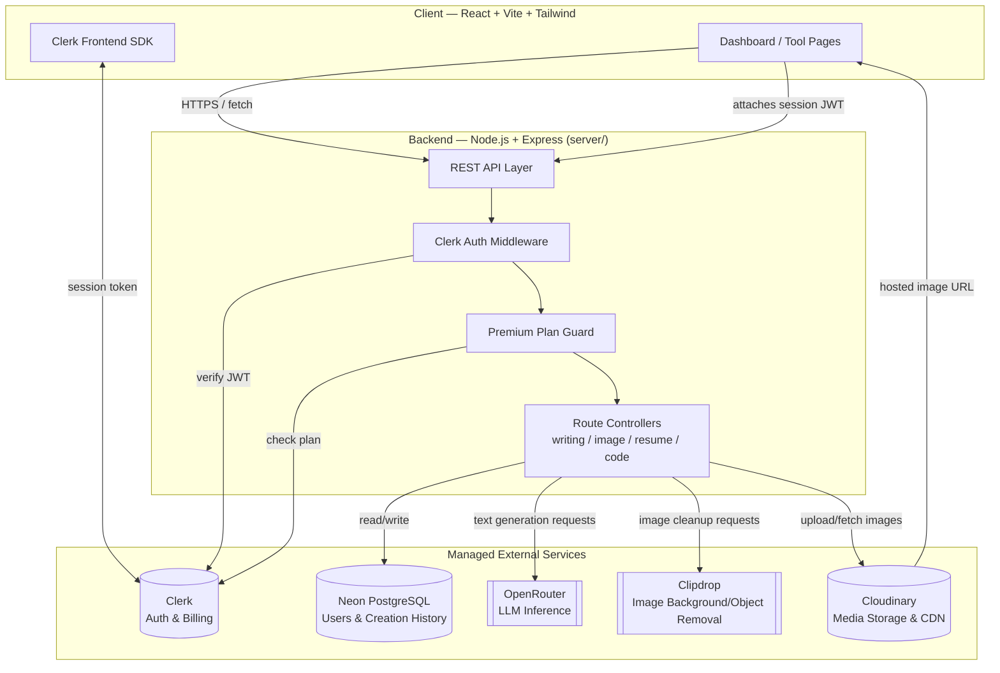

# AI SaaS App

A full-stack AI productivity platform offering tools for writing, image generation, image cleanup, and resume/code assistance — with free and premium tiers gated by Clerk subscriptions.


---

## Table of Contents

- [Features](#features)
- [Tech Stack](#tech-stack)
- [System Architecture](#system-architecture)
- [Request Flow](#request-flow)
- [Getting Started](#getting-started)
- [Environment Variables](#environment-variables)
- [Available API Routes](#available-api-routes)
- [Folder Structure](#folder-structure)
- [Troubleshooting](#troubleshooting)
- [License](#license)

---

## Features

### Free tools

| Tool | Description |
|---|---|
| AI Article Writer | Generates long-form articles from a prompt |
| Blog Title Generator | Suggests blog titles from a topic/keywords |
| Image Generator | Creates images from text prompts |
| Remove Image Background | Strips background from an uploaded image |
| Remove Image Object | Removes a selected object from an image |
| Resume Reviewer | Reviews an uploaded resume and gives feedback |

### Premium tools

Require an authenticated user with an active Clerk premium plan.

| Tool | Description |
|---|---|
| AI Email Writer | Drafts emails from a short brief |
| AI Text Summarizer | Condenses long text into a summary |
| Cover Letter Generator | Generates a tailored cover letter |
| AI Code Reviewer | Reviews code and suggests improvements |

### App capabilities

- Clerk-based authentication and session management
- Dashboard for browsing and launching tools
- Saved creation history per user
- Publishable image generation flow (share generated images)
- Responsive React + Tailwind UI

## Tech Stack

| Layer | Technology |
|---|---|
| Frontend | React, Vite, Tailwind CSS |
| Backend | Node.js, Express |
| Database | Neon PostgreSQL |
| Auth | Clerk |
| AI | OpenRouter (text), Clipdrop (image ops) |
| Media storage | Cloudinary |
| Deployment | Kubernetes (`k8s/`) |

---

## System Architecture

The app is a three-tier system: a React SPA talks to an Express API, which in turn calls out to managed third-party services (auth, database, AI inference, media storage) rather than hosting that logic itself.



**Key architectural notes**

- **Stateless API**: the Express backend holds no session state itself — Clerk issues and verifies session tokens, so the API can scale horizontally.
- **Two-stage middleware gate**: every premium route passes through an auth check (is this a valid, logged-in user?) followed by a plan check (does this user have an active premium subscription?) before reaching the controller.
- **AI calls are proxied, not client-direct**: the frontend never talks to OpenRouter or Clipdrop directly — the backend holds those API keys and brokers the request, keeping provider credentials off the client.
- **Media never touches the backend disk**: images are streamed to/from Cloudinary; the Express server does not persist uploaded or generated images to local storage.
- **Single source of truth for history**: every generation (article, image, review) is written to Neon Postgres so it can be surfaced in the user's dashboard history.

## Request Flow

Example: a logged-in user generates a cover letter (a premium tool).

1. **Client** sends `POST /api/ai/generate-cover-letter` with the Clerk session JWT in the `Authorization` header.
2. **Auth middleware** verifies the JWT against Clerk; rejects with `401` if invalid or missing.
3. **Premium middleware** checks the user's Clerk plan; rejects with `403` if not premium.
4. **Controller** builds a prompt and calls **OpenRouter** using `OPENROUTER_MODEL`.
5. **Controller** writes the result (and metadata) to **Neon PostgreSQL** as a history entry.
6. **API** returns the generated text to the client, which renders it and adds it to the dashboard history view.

Image tools (background/object removal, generation) follow the same shape, except the controller also round-trips the file through **Clipdrop** and stores the resulting asset in **Cloudinary**, returning a hosted URL to the client instead of raw bytes.

---

## Getting Started

### 1. Clone the repository

Replace `<your-repo-url>` with your actual Git repository URL.

```bash
git clone <your-repo-url>
cd ai-saas-app
```

If you are already inside the project folder, you can skip the clone step.

### 2. Install dependencies

```bash
cd server
npm install

cd ../client
npm install
```

### 3. Configure environment variables

See [Environment Variables](#environment-variables) below.

### 4. Run the app locally

Start the backend in one terminal:

```bash
cd server
npm start
```

Start the frontend in another terminal:

```bash
cd client
npm run dev
```

Open the Vite URL shown in the terminal, usually `http://localhost:5173`.

---

## Environment Variables

Create a `server/.env` file:

```env
PORT=5000
DATABASE_URL=your_neon_postgresql_connection_string
CLERK_SECRET_KEY=your_clerk_secret_key
OPENROUTER_API_KEY=your_openrouter_api_key
OPENROUTER_MODEL=openrouter/free
CLOUDINARY_CLOUD_NAME=your_cloudinary_cloud_name
CLOUDINARY_API_KEY=your_cloudinary_api_key
CLOUDINARY_API_SECRET=your_cloudinary_api_secret
CLIPDROP_API_KEY=your_clipdrop_api_key
```

Create a `client/.env` file:

```env
VITE_CLERK_PUBLISHABLE_KEY=your_clerk_publishable_key
VITE_BASE_URL=http://localhost:5000
```

**Notes**

- The frontend reads the Clerk publishable key from runtime config first, then falls back to `VITE_CLERK_PUBLISHABLE_KEY`.
- `VITE_BASE_URL` should point to your backend server during local development.
- The backend currently requires Cloudinary and Clipdrop settings for image features.
- If you deploy to another environment, set the same variables there as environment secrets or runtime config (see `k8s/` for cluster deployment manifests).

---

## Available API Routes

### Authentication

| Method | Route |
|---|---|
| POST | `/api/user/register` |
| POST | `/api/user/login` |

### Free AI routes

| Method | Route |
|---|---|
| POST | `/api/ai/generate-article` |
| POST | `/api/ai/generate-blog-title` |
| POST | `/api/ai/generate-image` |
| POST | `/api/ai/remove-image-background` |
| POST | `/api/ai/remove-image-object` |
| POST | `/api/ai/resume-review` |

### Premium AI routes

*Require a valid Clerk session **and** an active premium plan.*

| Method | Route |
|---|---|
| POST | `/api/ai/write-email` |
| POST | `/api/ai/summarize-text` |
| POST | `/api/ai/generate-cover-letter` |
| POST | `/api/ai/review-code` |

---

## Folder Structure

```text
ai-saas-app/
|-- client/     # React + Vite + Tailwind frontend
|-- server/     # Node.js + Express backend API
|-- k8s/        # Kubernetes deployment manifests
|-- README.md
```

---

## Troubleshooting

| Symptom | Check |
|---|---|
| Backend fails to start | `DATABASE_URL`, `CLERK_SECRET_KEY`, `OPENROUTER_API_KEY`, `CLOUDINARY_*`, `CLIPDROP_API_KEY` |
| Frontend cannot authenticate | `VITE_CLERK_PUBLISHABLE_KEY` |
| Frontend requests fail | `VITE_BASE_URL` points to the running backend |
| Premium routes return 403 | User's Clerk plan is not active/premium |
| Image tools fail | Cloudinary and Clipdrop credentials are set and valid |

---

## License

MIT