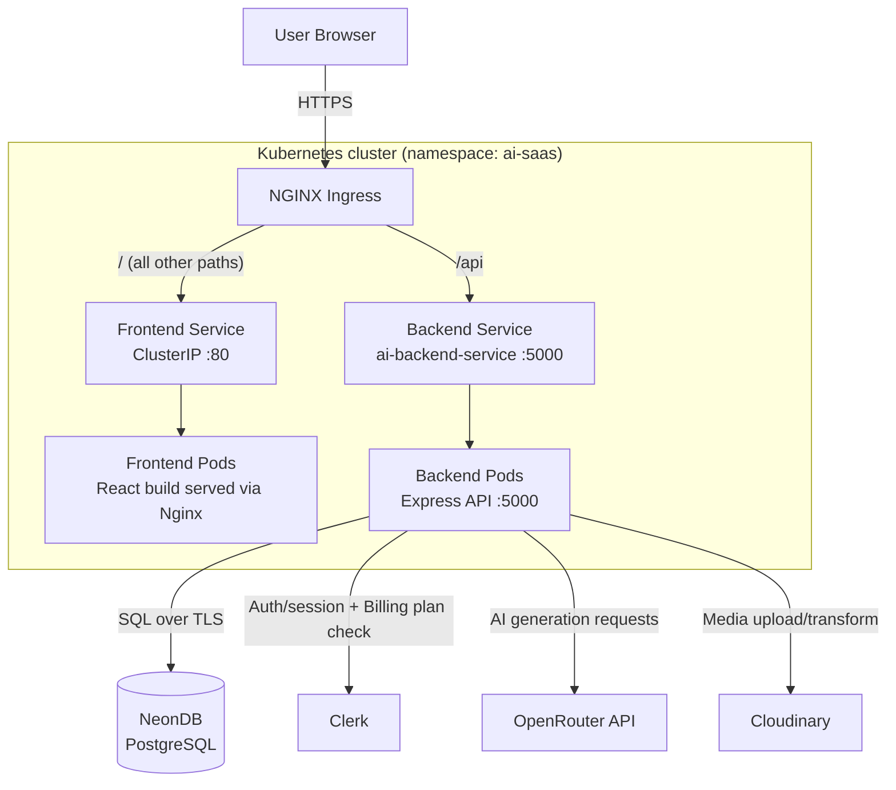
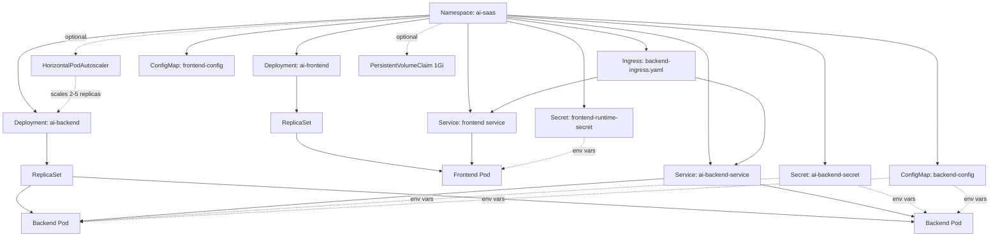

# AI SaaS App

AI SaaS App is a full-stack, modern SaaS platform that leverages artificial intelligence to provide a suite of productivity tools for creators, professionals, and businesses. The app features image generation, background/object removal, resume review, blog title creation, article writing, and more—all accessible via a clean, responsive dashboard.

---

## Table of Contents
- [Project Overview](#project-overview)
- [Features](#features)
- [Tech Stack](#tech-stack)
- [System Architecture](#system-architecture)
- [Getting Started](#getting-started)
- [Configuration](#configuration)
- [Usage](#usage)
- [API Endpoints](#api-endpoints)
- [Folder Structure](#folder-structure)
- [Deployment](#deployment)
- [Kubernetes Deployment](#kubernetes-deployment)
- [Troubleshooting & FAQ](#troubleshooting--faq)
- [Contributing](#contributing)
- [Credits & Acknowledgments](#credits--acknowledgments)
- [License](#license)

---

## Project Overview

AI SaaS App aims to democratize access to powerful AI tools for content creation, image editing, and productivity. Users can generate images, write articles, create blog titles, review resumes, and more—all from a single dashboard. The platform is built for scalability, security, and ease of use, with cloud storage and authentication.

---

## Features

- **Resume Review:** Get AI-powered feedback and suggestions for your resume.
- **Blog Title Generator:** Generate catchy blog titles based on your topic.
- **Article Writer:** Compose articles with AI assistance.
- **User Dashboard:** Track your creations and manage your account.
- **Authentication:** Secure login and registration using JWT.
- **Responsive UI:** Built with Tailwind CSS for seamless experience on all devices.

### Premium Features

The following tools require an authenticated user with an active Clerk Billing `premium` plan. Free users receive an HTTP `403` and no AI-provider request is made:

- **AI Email Writer** — generates a professional email from user input.
- **AI Text Summarizer** — summarizes supplied text.
- **AI Cover Letter Generator** — generates a customized cover letter.
- **AI Code Reviewer** — reviews submitted code and returns a structured markdown report (summary, issues, fixes, verdict).

---

## Tech Stack

| Layer | Technology | Purpose |
| --- | --- | --- |
| Frontend | React, Vite, Tailwind CSS | Dashboard UI and client-side routing |
| Backend | Node.js, Express | REST API and business logic |
| Database | NeonDB (PostgreSQL) | Persistent storage |
| Authentication | JWT, Clerk (Billing/plan checks) | User auth and premium-plan verification |
| AI Provider | OpenRouter | Powers AI generation endpoints |
| Media Storage | Cloudinary | Image storage/processing (initialized on backend startup) |
| Containerization | Docker | Packaging frontend and backend into images |
| Orchestration | Kubernetes (Kind for local, NGINX Ingress) | Runtime deployment, scaling, routing |
| Alternate Deployment | Vercel | Serverless deployment path (`vercel.json` in both `client` and `server`) |

> Not configured / not verifiable from the available README: exact Dockerfile base images, CI/CD pipeline, and AWS EC2 provisioning details. If these exist in the repo, they aren't documented here yet — see the note at the end of this section.

---

## System Architecture

The diagram below shows the request lifecycle for both the local/Vercel setup and the Kubernetes deployment path described in this README.



**Request lifecycle:**

1. The user's browser sends a request to the cluster's public entry point.
2. The **NGINX Ingress** inspects the path: requests to `/api` are routed to the backend service; every other path goes to the frontend service.
3. The **Frontend Service** (ClusterIP, port `80`) load-balances traffic across the **Frontend Pods**, which serve the built React app via Nginx.
4. The **Backend Service** (`ai-backend-service`) load-balances traffic across the **Backend Pods**, which run the Express API on port `5000`.
5. For AI tool requests, the backend calls **OpenRouter** with the user's prompt and returns the generated result.
6. For premium endpoints, the backend checks the user's Clerk Billing plan before calling OpenRouter; free users are rejected with `403` and no AI request is made.
7. The backend reads/writes application data (users, generation history, etc.) in **NeonDB (PostgreSQL)**.
8. Image-related tools go through **Cloudinary** for storage/processing.
9. **Deployments** keep the desired number of frontend/backend Pods running; if a Pod crashes, the Deployment's ReplicaSet replaces it automatically.
10. **ConfigMaps** supply non-secret runtime values (e.g., `PORT`, `API_URL`); **Secrets** supply credentials (`DATABASE_URL`, `JWT_SECRET`, Clerk keys, `OPENROUTER_API_KEY`, Cloudinary keys) as environment variables to the Pods.

### Kubernetes object relationships



- **Namespace (`ai-saas`)** isolates all of this application's resources from other workloads in the cluster.
- **Deployments** (`ai-backend`, `ai-frontend`) declare the desired Pod state; Kubernetes creates a **ReplicaSet** to maintain that count and creates a new ReplicaSet on each rollout.
- **Services** give Pods a stable internal DNS name and IP even as individual Pods are replaced — the backend is reachable in-cluster at `ai-backend-service:5000`.
- **Ingress** is the single public entry point, doing path-based routing (`/api` → backend, everything else → frontend) instead of exposing each Service directly.
- **ConfigMaps/Secrets** decouple configuration and credentials from the container images, so the same image can run in different environments.
- **HPA** and **PVC** are optional: the HPA scales the backend 2→5 replicas on CPU load (requires Metrics Server); the PVC reserves 1Gi for backend data but is only used if the backend is configured to mount it.

---

## Getting Started

### Prerequisites

| Tool | Why it's needed | Verify |
| --- | --- | --- |
| Git | Clone the repository | `git --version` |
| Node.js & npm | Install/run the frontend and backend | `node --version` / `npm --version` |
| NeonDB (PostgreSQL) account | Provides `DATABASE_URL` for the backend | Connection string from the Neon dashboard |
| Clerk account | Auth + premium billing/plan checks | `CLERK_SECRET_KEY` / `CLERK_PUBLISHABLE_KEY` from the Clerk dashboard |
| OpenRouter API key | Powers the AI generation endpoints | `OPENROUTER_API_KEY` from OpenRouter |
| Cloudinary account | Required — the backend initializes Cloudinary on startup | Cloud name, API key, API secret |
| Docker *(for containerized/K8s workflow)* | Build frontend/backend images | `docker version` |
| kubectl *(for K8s workflow)* | Manage the cluster | `kubectl version --client` |
| Kind *(for local K8s workflow)* | Local Kubernetes cluster | `kind version` |

### Step-by-step local setup

1. **Clone the repository**
   ```sh
   git clone https://github.com/mayurCoder2004/ai-saas-app.git
   cd ai-saas-app
   ```

2. **Install backend dependencies**
   ```sh
   cd server
   npm install
   ```

3. **Install frontend dependencies**
   ```sh
   cd ../client
   npm install
   ```

4. **Configure environment variables** — create `server/.env` and `client/.env` as shown in [Configuration](#configuration). At minimum the backend needs a working `DATABASE_URL`, `JWT_SECRET`, and `OPENROUTER_API_KEY`; Clerk and Cloudinary credentials are also required for auth, billing checks, and startup, respectively.

5. **Start the backend** (from `server/`)
   ```sh
   npm start
   ```
   The API listens on the port defined by your backend config (see [API Endpoints](#api-endpoints) for the example using port `5000`).

6. **Start the frontend** (from `client/`, in a separate terminal)
   ```sh
   npm run dev
   ```
   Vite will print a local URL (typically `http://localhost:5173`) — open it in your browser.

7. **Verify the connection** — the frontend calls the backend at the URL set in `client/.env` (`VITE_BASE_URL`). Register a user from the UI and confirm the dashboard loads; if requests fail, check the backend terminal for errors and confirm `VITE_BASE_URL` matches where the backend is actually running.

For a containerized/Kubernetes setup instead of running Node directly, see [Kubernetes Deployment](#kubernetes-deployment), which covers building images, creating the namespace/secrets, and deploying with `kubectl`.

---

## Configuration

Create `.env` files in both `client` and `server` directories. Example variables:

**server/.env**
```
DATABASE_URL=your_neondb_postgresql_connection_string
JWT_SECRET=your_jwt_secret
OPENROUTER_API_KEY=your_key_here
```

**client/.env**
```
VITE_BASE_URL=http://localhost:5000
```

> The Kubernetes path additionally requires Clerk (`CLERK_SECRET_KEY`, `CLERK_PUBLISHABLE_KEY`) and Cloudinary (`CLOUDINARY_CLOUD_NAME`, `CLOUDINARY_API_KEY`, `CLOUDINARY_API_SECRET`) credentials — see [Kubernetes Deployment](#kubernetes-deployment) for how these are supplied as cluster Secrets rather than local `.env` files.

---

## Usage

1. Register or log in to access the dashboard.
2. Use the sidebar to navigate between tools:
   - Generate images
   - Write articles
   - Create blog titles
   - Review resumes
   - Remove backgrounds/objects from images
   - *(Premium)* Write emails, summarize text, generate cover letters, review code
3. View, download, or share your creations.

## API Endpoints

### Authentication
- `POST /api/user/register` — Register a new user
- `POST /api/user/login` — Log in

### AI Tools
- `POST /api/ai/review-resume` — Review resume
- `POST /api/ai/blog-titles` — Generate blog titles
- `POST /api/ai/write-article` — Write an article

### Premium AI Tools

The following endpoints require an authenticated user with an active Clerk
Billing `premium` plan. Free users receive HTTP `403` and no AI-provider
request is made.

- `POST /api/ai/write-email` — Generate a professional email
- `POST /api/ai/summarize-text` — Summarize supplied text
- `POST /api/ai/generate-cover-letter` — Generate a cover letter
- `POST /api/ai/review-code` — Review submitted code and return a structured markdown report with summary, issues, fixes, and verdict

### Example Request
```sh
curl -X POST http://localhost:5000/api/ai/generate-article \
  -H "Authorization: Bearer <token>" \
  -H "Content-Type: application/json" \
  -d '{"prompt": "A futuristic cityscape at sunset"}'
```

---

## Folder Structure

```
ai-saas-app/
├── client/        # Frontend (React)
│   ├── src/
│   │   ├── assets/         # Images, icons, etc.
│   │   ├── components/     # Reusable React components
│   │   ├── pages/          # Page components (Dashboard, Tools, etc.)
│   │   └── ...
│   ├── public/             # Static files
│   └── ...
├── server/        # Backend (Node.js/Express)
│   ├── controllers/        # Route controllers
│   ├── routes/             # API route definitions
│   ├── configs/            # Config files (DB, etc.)
│   ├── middlewares/        # Express middlewares
│   └── ...
```

---

## Deployment

### Vercel
This app is ready to deploy on Vercel. See `vercel.json` in both `client` and `server` for configuration.

1. Push your code to GitHub.
2. Import the project into Vercel.
3. Set environment variables in Vercel dashboard.
4. Deploy!

---

## Kubernetes Deployment

The `k8s/` directory deploys the application into the `ai-saas` namespace:

| Component | Kubernetes resource | Purpose |
| --- | --- | --- |
| Backend | Deployment and ClusterIP Service | Runs the Express API on port `5000`. |
| Frontend | Deployment and ClusterIP Service | Serves the React build through Nginx on port `80`. |
| Routing | NGINX Ingress | Sends `/api` to the backend and all other paths to the frontend. |
| Configuration | ConfigMaps | Provides non-sensitive runtime settings such as `PORT` and `API_URL`. |
| Credentials | Secrets | Provides database, Clerk, OpenRouter, and other private values at runtime. |
| Storage | PersistentVolumeClaim | Reserves `1Gi` for backend data when the backend is configured to use it. |
| Scaling | HorizontalPodAutoscaler | Optionally scales the backend from 2 to 5 replicas based on CPU use. |

### 1. Prerequisites

Install the following before starting:

- [Docker](https://docs.docker.com/get-docker/) to build images and run a local Kind cluster.
- [kubectl](https://kubernetes.io/docs/tasks/tools/) to manage Kubernetes resources.
- [Kind](https://kind.sigs.k8s.io/docs/user/quick-start/) for the local-cluster workflow below.
- An NGINX Ingress controller. It is required because the supplied Ingress uses `ingressClassName: nginx`.
- Valid Neon PostgreSQL, Clerk, and OpenRouter credentials. Cloudinary credentials are also needed while the current backend initializes Cloudinary on startup.

Check that the local tools can communicate with Docker:

```sh
docker version
kubectl version --client
kind version
```

### 2. Review the Kubernetes manifests

The manifests are intentionally split into small files. Apply only the workload files listed in the deployment step; `backend-pod.yaml` is an older standalone debugging pod and should not be deployed alongside `backend-deployment.yaml`.

| File | Apply during normal deployment? | Notes |
| --- | --- | --- |
| `ai-saas-namespace.yaml` | Yes | Creates the `ai-saas` namespace. |
| `backend-config.yaml` | Yes | Backend non-secret settings. |
| `backend-secret.yaml` | No | Contains example secret data. Create the real secret with the command below instead. |
| `backend-deployment.yaml` | Yes | Two backend replicas, probes, resource requests, and limits. |
| `backend-service.yaml` | Yes | Internal backend DNS name: `ai-backend-service`. |
| `frontend-config.yaml` | Yes | Defines the browser API path as `/api`. |
| `frontend-secret.yaml` | No | Create the real frontend secret with the command below instead. |
| `frontend-deployment.yaml` | Yes | Generates browser runtime config from the frontend Secret. |
| `frontend-service.yaml` | Yes | Internal frontend service on port `80`. |
| `backend-ingress.yaml` | Yes | Public path-based routing. |
| `backend-hpa.yaml` | Optional | Requires Metrics Server to report CPU metrics. |
| `backend-pvc.yaml` | Optional | Create only when the application needs persistent filesystem storage. |
| `pvc-test-pod.yaml` | Optional | Writes a test file to the PVC for storage verification. |
| `kind-config.yaml` | Local Kind only | Maps host ports `80` and `443` to the Kind control-plane node. |

### 3. Build and publish images

The Deployments reference `tanmayanand24/saas-backend:latest` and `tanmayanand24/saas-frontend:latest`. Build and push images with those names, or change the `image` fields in the Deployment manifests to your own registry names before deploying.

```sh
docker build -t tanmayanand24/saas-backend:latest ./server
docker build -t tanmayanand24/saas-frontend:latest ./client
docker push tanmayanand24/saas-backend:latest
docker push tanmayanand24/saas-frontend:latest
```

For a local-only Kind workflow, you can avoid pushing to a registry after building:

```sh
kind load docker-image tanmayanand24/saas-backend:latest --name ai-saas
kind load docker-image tanmayanand24/saas-frontend:latest --name ai-saas
```

When using loaded local images, change `imagePullPolicy: Always` to `IfNotPresent` in both Deployment files. Otherwise Kubernetes may still try to pull the images from a remote registry.

### 4. Create a local Kind cluster

The provided Kind configuration exposes ports `80` and `443` on the host. Ensure no other local service is already using them, then create the cluster:

```sh
kind create cluster --name ai-saas --config k8s/kind-config.yaml
kubectl cluster-info --context kind-ai-saas
```

Install the NGINX Ingress controller for Kind, then wait for it to become ready:

```sh
kubectl apply -f https://raw.githubusercontent.com/kubernetes/ingress-nginx/main/deploy/static/provider/kind/deploy.yaml
kubectl wait --namespace ingress-nginx \
  --for=condition=Ready pod \
  --selector=app.kubernetes.io/component=controller \
  --timeout=180s
```

For a managed Kubernetes provider, skip Kind-specific commands and install the provider-supported NGINX Ingress controller instead. The rest of the manifests use standard Kubernetes APIs.

### 5. Create the namespace and runtime secrets

Do not commit real credential values to Git, add them to Dockerfiles, or pass them as Docker build arguments. The backend Deployment expects a Secret named `ai-backend-secret`, while the frontend Deployment expects `frontend-runtime-secret`.

Create the namespace first:

```sh
kubectl apply -f k8s/ai-saas-namespace.yaml
```

Create or update the backend Secret. Replace every placeholder with a real value:

```sh
kubectl create secret generic ai-backend-secret \
  --namespace ai-saas \
  --from-literal=DATABASE_URL='your_neon_postgresql_connection_string' \
  --from-literal=JWT_SECRET='a_long_random_secret' \
  --from-literal=CLERK_SECRET_KEY='your_clerk_secret_key' \
  --from-literal=CLERK_PUBLISHABLE_KEY='your_clerk_publishable_key' \
  --from-literal=OPENROUTER_API_KEY='your_openrouter_api_key' \
  --from-literal=CLOUDINARY_CLOUD_NAME='your_cloudinary_cloud_name' \
  --from-literal=CLOUDINARY_API_KEY='your_cloudinary_api_key' \
  --from-literal=CLOUDINARY_API_SECRET='your_cloudinary_api_secret' \
  --dry-run=client -o yaml | kubectl apply -f -
```

Create the frontend Secret. The Clerk publishable key is public by design, but this Secret lets the same image be configured for different environments at runtime:

```sh
kubectl create secret generic frontend-runtime-secret \
  --namespace ai-saas \
  --from-literal=CLERK_PUBLISHABLE_KEY='your_clerk_publishable_key' \
  --dry-run=client -o yaml | kubectl apply -f -
```

The checked-in `k8s/*secret.yaml` files must be treated as templates only. If real credentials have ever been committed or shared, revoke and rotate them in their respective provider dashboards before deployment.

### 6. Deploy the application

Apply the non-secret configuration and workloads in dependency order:

```sh
kubectl apply -f k8s/backend-config.yaml
kubectl apply -f k8s/frontend-config.yaml
kubectl apply -f k8s/backend-deployment.yaml
kubectl apply -f k8s/backend-service.yaml
kubectl apply -f k8s/frontend-deployment.yaml
kubectl apply -f k8s/frontend-service.yaml
kubectl apply -f k8s/backend-ingress.yaml
```

Wait for both Deployments to finish their rollout:

```sh
kubectl rollout status deployment/ai-backend --namespace ai-saas
kubectl rollout status deployment/ai-frontend --namespace ai-saas
kubectl get pods,services,ingress --namespace ai-saas
```

The backend health endpoint is `/`; it must return `Server is running` for the backend liveness and readiness probes to pass.

### 7. Access and verify the application

With Kind and the supplied port mappings, open the app at:

```text
http://localhost/
```

Verify the API through the Ingress:

```sh
curl http://localhost/api/ai
curl http://localhost/
```

The first command may return an application-level `404` because there is no root handler for `/api`; that confirms the request reached the backend. The second should serve the frontend. To bypass Ingress during diagnosis, port-forward a Service:

```sh
kubectl port-forward --namespace ai-saas service/ai-backend-service 5000:5000
kubectl port-forward --namespace ai-saas service/ai-frontend-service 8080:80
```

Then access the backend at `http://localhost:5000/` and the frontend at `http://localhost:8080/`.

### 8. Optional persistent storage and autoscaling

Create and test the PVC only if the backend is changed to mount and use it. The current backend Deployment does not mount this claim.

```sh
kubectl apply -f k8s/backend-pvc.yaml
kubectl apply -f k8s/pvc-test-pod.yaml
kubectl logs --namespace ai-saas pvc-test-pod
kubectl exec --namespace ai-saas pvc-test-pod -- cat /data/test.txt
```

The HPA needs Metrics Server. On Kind, install it using a configuration appropriate to your environment, confirm metrics are available, then apply the HPA:

```sh
kubectl top nodes
kubectl apply -f k8s/backend-hpa.yaml
kubectl get hpa --namespace ai-saas
```

If `kubectl top` reports that metrics are unavailable, install or repair Metrics Server before expecting autoscaling to work.

### 9. Update and operate the deployment

After publishing a new image under the same `latest` tag, restart the relevant Deployment to pull it:

```sh
kubectl rollout restart deployment/ai-backend --namespace ai-saas
kubectl rollout restart deployment/ai-frontend --namespace ai-saas
kubectl rollout status deployment/ai-backend --namespace ai-saas
kubectl rollout status deployment/ai-frontend --namespace ai-saas
```

For versioned tags, update the image explicitly and keep the tag in source control:

```sh
kubectl set image deployment/ai-backend backend=your-registry/saas-backend:1.0.0 --namespace ai-saas
kubectl set image deployment/ai-frontend frontend=your-registry/saas-frontend:1.0.0 --namespace ai-saas
```

When Secret values change, Kubernetes does not automatically restart pods that consume them as environment variables. Restart the affected Deployment after updating the Secret:

```sh
kubectl rollout restart deployment/ai-backend --namespace ai-saas
kubectl rollout restart deployment/ai-frontend --namespace ai-saas
```

Useful operational commands:

```sh
kubectl get all --namespace ai-saas
kubectl describe deployment ai-backend --namespace ai-saas
kubectl logs --namespace ai-saas deployment/ai-backend --follow
kubectl logs --namespace ai-saas deployment/ai-frontend --follow
kubectl get events --namespace ai-saas --sort-by=.lastTimestamp
```

To verify that a required environment variable exists without printing its value:

```sh
kubectl exec --namespace ai-saas deployment/ai-backend -- \
  sh -c 'test -n "$DATABASE_URL" && echo DATABASE_URL_is_set'
```

### 10. Troubleshooting

| Symptom | What to check |
| --- | --- |
| Pods are `ImagePullBackOff` | Confirm the image name/tag exists, registry access is available, or load the image into Kind and use `IfNotPresent`. |
| Backend is `CrashLoopBackOff` | Inspect `kubectl logs -n ai-saas deployment/ai-backend`; verify all Secret keys and provider credentials. |
| Backend stays unready | Check `kubectl describe pod -n ai-saas <pod-name>` and confirm `GET /` returns HTTP `200`. |
| Ingress returns `404` or `502` | Confirm the NGINX Ingress controller is ready, the Ingress exists, and both Services have endpoints with `kubectl get endpoints -n ai-saas`. |
| Frontend cannot call the API | Confirm `config.js` is mounted, browser requests use `/api`, and Ingress routes `/api` to `ai-backend-service:5000`. |
| Clerk initialization fails | Confirm `frontend-runtime-secret` contains the correct `CLERK_PUBLISHABLE_KEY` and restart `ai-frontend`. |
| HPA shows `<unknown>` metrics | Install/repair Metrics Server and verify `kubectl top pods -n ai-saas` produces values. |
| PVC remains `Pending` | Inspect available StorageClasses with `kubectl get storageclass`; Kind normally provides `standard`. |

### 11. Remove the local deployment

Delete the application resources but retain the namespace and any resources inside it:

```sh
kubectl delete -f k8s/backend-ingress.yaml
kubectl delete -f k8s/frontend-service.yaml
kubectl delete -f k8s/frontend-deployment.yaml
kubectl delete -f k8s/backend-service.yaml
kubectl delete -f k8s/backend-deployment.yaml
```

To remove everything in the application namespace, including Secrets and persistent data, delete the namespace:

```sh
kubectl delete namespace ai-saas
```

To remove the Kind cluster entirely:

```sh
kind delete cluster --name ai-saas
```

---

## Troubleshooting & FAQ

**Q: The app won't start!**
A: Check that all environment variables are set and NeonDB (PostgreSQL) is accessible.

**Q: API requests fail with 401.**
A: Make sure you are sending the JWT token in the `Authorization` header.

**Q: How do I switch databases?**
A: Update the NeonDB connection string in `server/.env`.

---

## Contributing

Pull requests are welcome! For major changes, please open an issue first to discuss what you would like to change.

---

## Credits & Acknowledgments

- [React](https://react.dev/)
- [Vite](https://vitejs.dev/)
- [Tailwind CSS](https://tailwindcss.com/)
- [Node.js](https://nodejs.org/)
- [Express](https://expressjs.com/)
- [MongoDB](https://www.mongodb.com/)
- [Vercel](https://vercel.com/)

---

## License

This project is licensed under the MIT License.